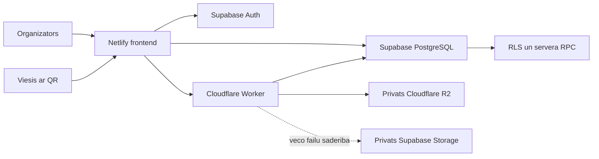

# Event Photo SaaS MVP arhitektura

## Merkis

Sistema apkopo pasakuma viesu fotografijas viena galerija. Organizators autentificejas, izveido pasakumu un izplata unikalu saiti vai QR kodu. Viesis neveido kontu: ievada vardu, uznem foto un augšupielade to. Produkts ir tikai fotografijam; video netiek pienemts.

## Augsta limena uzbuve



Atbildibas ir nodalitas:

- Netlify piegada statisko saskarni.
- Supabase Auth parvalda organizatoru identitati un sesijas.
- PostgreSQL glaba pasakumu, viesu, media, kopigosanas un R2 objektu metadatus.
- RLS un RPC nodrosina datu robezas servera puse.
- Cloudflare Worker ir vienigais komponents ar R2 un Supabase service role noslepumiem.
- Privats R2 glaba jaunos WebP originalus, thumbnails un cover attelus.
- Supabase Storage paliek tikai veco failu lasisanas saderibai.

## Frontend

Frontend ir HTML, CSS un JavaScript aplikacija:

- `index.html` satur autentifikacijas, dashboard, event detail, archive, guest, gallery un dialogu skatus;
- `style.css` nodrosina responsive dark/light saskarni un mobilo safe-area izkartojumu;
- `script.js` orķestre Auth, eventus, QR, viesa plusmu, galeriju, dzesanu un ZIP;
- `r2-storage.js` realize R2 rezervaciju, upload un finalize klienta plusmu;
- `guest-gallery.js` realize pec-pasakuma viesu galerijas ieladi;
- `reliability.js` satur kopigas laika, upload retry un pieprasijumu kontroles funkcijas.

Frontend glaba tikai publiski lietojamas vertibas: Supabase URL, publishable key un Worker URL.

## Production build un hostings

Netlify konfiguracija atrodas `netlify.toml`:

```text
Build command: npm run build
Publish directory: dist
Node version: 22
```

`scripts/build-site.mjs` izveido noteiktu `dist/` saturu un aptur build, ja publicesanas direktorija ir neparedzets fails. SPA redirecti nodrosina tiesu `/event/*` un `/auth/*` adresu darbibu.

## Datubaze un autorizacija

Pamatentites:

- `users` - organizatora profils, sasaistits ar `auth.users`;
- `events` - pasakums, periods, statuss, viesu dizains un ZIP stavoklis;
- `guests` - viesa identitate viena pasakuma ietvaros;
- `media` - foto metadati un logiskie originala/thumbnail celi;
- `gallery_shares` - pec-pasakuma viesu galerijas ieslegsana un termins;
- `r2_objects` - privata R2 objekta registrs, stavoklis, checksum un fiziska objekta atslega.

Organizatora piekluve balstas uz Supabase JWT un `events.owner_id = auth.uid()`. Viesa upload ir atlauts tikai konkreta aktiva pasakuma precizaja laika perioda. Privats bucket un servera autorizacija nozime, ka faila URL pats par sevi nepiešķir piekluvi.

## Jauna foto upload plusma

1. Viesis atver eventa saiti un izveido `guests` ierakstu.
2. Kamera atgriez attela failu; klients parbauda tipu un izmeru.
3. Parluka tiek izveidots optimizets WebP originals un WebP thumbnail.
4. `prepare_photo_upload` izveido `media` ierakstu stavokli `pending`.
5. Klients nosuta Worker objektu celu, tipu, izmeru un checksum.
6. Worker ar `reserve_r2_object` parbauda eventu, viesi, celu, limitu un dublēšanos.
7. Worker atgriez islaicigu presigned PUT adresi tikai vienam objektam.
8. Parluks suta binaros datus tiesi uz R2, neizpauzot R2 atslēgas.
9. Worker nolasa objektu un parbauda izmeru/checksum.
10. Pec originala un thumbnail apstiprinasanas `complete_r2_photo` nomaina media stavokli uz `uploaded`.

Nepabeigts uploads galerija netiek uzskatits par gatavu foto. Atkartota finalize darbiba ir idempotenta, bet dublēts neatlauts objekts tiek noraidits.

## R2 objektu struktura

Datubazes tiesibas vienmer balstas uz UUID. Lasamie prefiksi ir tikai administratora orientacijai:

```text
{organizer-name}--{owner-id}/
  {event-name}--{event-id}/
    {guest-name}--{guest-id}/
      {guest-name}_{utc-date-time}_{media-id}.webp
      thumb-{guest-name}_{utc-date-time}_{media-id}.webp
```

Nosaukuma maina neprasa parvietot jau esošus failus, jo konkreta prefiksa vertiba tiek fiksēta objektu registra. Vienadi vardi nekonflikte UUID del.

## Privata failu lasisana

Organizatora galerija:

1. frontend sutа Supabase access token Worker;
2. Worker parbauda tokenu ar Supabase Auth;
3. servera RPC parbauda eventa ipasnieku;
4. Worker straume failu no R2 ar `Cache-Control: no-store`.

Viesu galerija:

1. organizators pec eventa beigam iesledz kopigosanu uz noteiktu terminu;
2. viesis izmanto esošo eventa saiti;
3. Worker izsauc `guest_gallery_access` ar service role;
4. RPC parbauda statusu, terminu, pieprasito foto un kvotu;
5. tikai tad Worker atgriez thumbnail vai originalu.

## Laika modelis

Organizators ievada vietejos sakuma un beigu laikus. Parluks automātiski nodod IANA laika zonas nosaukumu, piemeram, `Europe/Riga`. Datubaze genere `starts_at` un `ends_at` ka `timestamptz`, tapec salidzinajumi notiek pec reala UTC momenta arī arpus Latvijas un vasaras/ziemas laika parējas.

Perioda robeza ir pusatverta:

```text
starts_at <= now < ends_at
```

## Foto optimizacija

- optimizeta originala limits: 6 MiB;
- thumbnail limits R2 rezervacijai: 1 MiB;
- galerijas rezgis ielade thumbnails;
- originals tiek pieprasits tikai preview un ZIP;
- video un citi neatlauti MIME tipi tiek noraiditi;
- cover attels izmanto atsevisku organizatora autorizetu R2 celu.

## ZIP un dzesana

ZIP MVP tiek veidots parluka no autorizeti iegutiem originaliem pec eventa beigam. Veiksmiga sagatavosana aizpilda `events.zip_downloaded_at`; atverta sesija var saglabat jau sagatavoto arhivu velreiz. Liela apjoma produkta versijai ZIP vajadzetu parvietot uz fona servera darbu.

Foto dzesana izsauc Worker, kas parbauda eventa ipasnieku, dzes originalu un thumbnail no R2 un saskano datubazes stavokli. Eventa `Delete` UI darbiba pasakumu arhive; ta nav tūlītēja visu failu fiziska dzesana.

## Kļudu un retry princips

- Lietotajam tiek radits saprotams stavoklis, nevis SQL vai Storage kļudas teksts.
- Upload ir atkārtojams no sagatavota optimizeta faila.
- `pending` ieraksts nekļust par `uploaded`, kamer nav abi objekti.
- Galerijas novecojušas atbildes netiek iekrāsotas pec eventa vai filtra mainas.
- R2 un vecais Supabase avots tiek apstradats caur kopigu media adapteri.
- CORS nosaka, kuri frontend origin drikst zvanit Worker, bet tas neaizstaj autorizaciju.

## Drošibas robezas

- Organizators neredz cita organizatora eventus vai foto.
- Viesim nav Supabase Auth konta un nav dashboard piekluves.
- UUID vai objekta atslega nav piekluves apliecinajums.
- R2 bucket publiska piekluve ir izslegta.
- R2 un service role atslēgas ir tikai Cloudflare Worker secretos.
- Privata lasisana katru reizi parbauda tiesibas; signed lasisanas URL netiek publicets ilglaicigai lietosanai.
- RPC, kas izmanto service role robezu, nav izpildami `anon` vai `authenticated` lomam.

## MVP robezas

MVP nav video, maksajumu, abonementu, komandu kontu, servera attelu apstrades, fona ZIP darbu vai automatiskas visa storage dzives cikla dzesanas. Vecie Supabase Storage objekti paliek lidz atseviskai verificetai migracijai.
