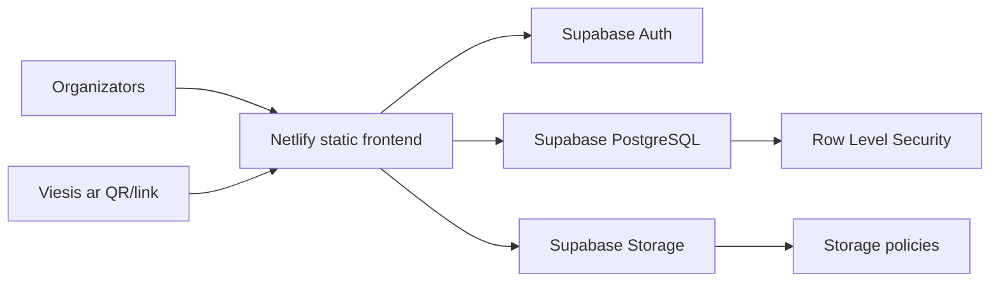

# Event Photo SaaS MVP arhitektūra

## Mērķis

Event Photo SaaS MVP ir photo-only risinājums pasākumu fotogrāfiju apkopošanai. Organizators izveido pasākumu, saņem unikālu viesu saiti un QR kodu, bet viesi bez konta var uzņemt un augšupielādēt foto. Organizators pēc pieslēgšanās savā kontā redz tikai savus pasākumus un tiem piesaistītās galerijas.

MVP galvenā ķēde:

```text
Organizer register/login
-> Create event
-> QR/link
-> Guest name
-> Take photo
-> Supabase Storage
-> Organizer gallery
-> Delete photo / Download ZIP after event
```

## Augsta līmeņa arhitektūra



## Sistēmas daļas

### Frontend

Frontend ir statiska HTML, CSS un JavaScript aplikācija:

- `index.html` satur galvenos skatus: autentifikāciju, dashboard, event detail, guest upload, guest design modal un photo preview dialogu.
- `style.css` nosaka dark/light mode dizainu, responsive izkārtojumu un mobile guest pieredzi, tostarp iPhone/Android viewport centrēšanu un safe-area atstarpi pārlūka joslām.
- `script.js` satur Supabase savienojumu, Auth plūsmu, eventu loģiku, QR ģenerēšanu, guest upload, galeriju, thumbnails, ZIP un kļūdu apstrādi.

Frontend izmanto Supabase publishable key. Service role key, paroles un citi secrets netiek glabāti repozitorijā.

### Netlify

Netlify nodrošina tikai frontend hostingu.

Konfigurācija:

```text
Build command: nav vajadzīgs
Publish directory: projekta sakne
Deploy branch: main
```

`netlify.toml` izmanto redirect uz `index.html`, lai tiešās saites strādātu arī pēc refresh:

- `/event/{slug}`
- `/auth/confirmed`

### Supabase

Supabase ir backend slānis:

- Supabase Auth: organizatoru reģistrācija, login, logout un e-pasta apstiprināšana.
- Supabase PostgreSQL: lietotāju, eventu, viesu un media metadati.
- Supabase Storage: oriģinālie foto, thumbnails un guest cover images.
- RLS un Storage policies: datu izolācija starp organizatoriem.

Pilnā shēma un politikas atrodas:

```text
supabase/schema.sql
```

## Datu modelis

### `users`

Glabā organizatora profila datus un ir sasaistīts ar `auth.users`.

Galvenie lauki:

- `id`
- `email`
- `first_name`
- `last_name`
- `created_at`

### `events`

Glabā organizatora izveidotos pasākumus.

Galvenie lauki:

- `id`
- `owner_id`
- `name`
- `slug`
- `status`
- `start_date`
- `end_date`
- `storage_folder`
- `guest_title`
- `guest_subtitle`
- `guest_button_text`
- `cover_image_path`
- `cover_position_x`
- `cover_position_y`
- `cover_zoom`
- `zip_downloaded_at`
- `created_at`

Svarīgi ierobežojumi:

- event periods nedrīkst būt garāks par 3 dienām;
- pagātnes eventus nevar izmantot viesu uploadam;
- pēc event perioda beigām guest upload vairs nav pieejams;
- ZIP download ir pieejams tikai pēc eventa beigām un tikai vienu reizi.

### `guests`

Glabā viesa ierakstu konkrētam eventam.

Galvenie lauki:

- `id`
- `event_id`
- `name`
- `created_at`

Viesis nav pilns sistēmas lietotājs un neveido Supabase Auth kontu.

### `media`

Glabā foto metadatus, nevis pašus failus.

Galvenie lauki:

- `id`
- `event_id`
- `guest_id`
- `storage_path`
- `thumbnail_path`
- `file_type`
- `file_size`
- `status`
- `created_at`

Faili atrodas Supabase Storage bucket `event-photos`.

## Storage struktūra

Foto faili tiek glabāti lasāmā mapju struktūrā:

```text
event-name-1234/
  guest-name-5678/
    guest-name_2026-08-16_14-37-11.jpg
    thumb_guest-name_2026-08-16_14-37-11.jpg
```

Cover images tiek glabāti atsevišķā sadaļā:

```text
event-covers/
  {event_id}/
    cover_2026-08-31_18-45-20.jpg
```

## Photo upload un thumbnails

Upload plūsma:

1. Viesis izvēlas vai uzņem foto.
2. Frontend pārbauda, vai fails ir attēls.
3. Frontend pārbauda 6 MB limitu.
4. Pārlūkā tiek mēģināts optimizēt oriģinālo foto.
5. Tiek izveidots thumbnail.
6. Oriģināls un thumbnail tiek augšupielādēti Supabase Storage.
7. `media` tabulā tiek saglabāti `storage_path` un `thumbnail_path`.

Galerijas grid izmanto `thumbnail_path`, lai samazinātu Supabase egress. Oriģinālais `storage_path` tiek prasīts tikai tad, kad organizators atver preview vai lejupielādē ZIP.

## Auth un autorizācija

Organizators:

- reģistrējas ar vārdu, uzvārdu, e-pastu un paroli;
- apstiprina e-pastu;
- pieslēdzas ar Supabase Auth;
- redz tikai savus eventus;
- redz tikai saviem eventiem piesaistītos viesus un media ierakstus.

Viesis:

- neveido kontu;
- atver tikai konkrētā eventa publisko linku;
- var izveidot guest ierakstu tikai aktīvam eventam tā norādītajā periodā;
- var augšupielādēt foto tikai aktīvam eventam;
- neredz organizatora dashboard vai galeriju.

## RLS un Storage politikas

RLS tiek izmantots kā galvenā drošības robeža.

Datubāzes līmenī:

- `users`: lietotājs lasa/labo tikai savu profilu.
- `events`: organizators lasa/labo tikai savus eventus.
- `guests`: organizators lasa tikai saviem eventiem piesaistītos viesus; anon viesis var pievienoties tikai aktīvam eventam.
- `media`: organizators lasa/labo tikai saviem eventiem piesaistītos media ierakstus; anon viesis var izveidot media ierakstu tikai aktīvam eventam.

Storage līmenī:

- bucket `event-photos` ir privāts;
- viesis var uploadot tikai aktīva eventa mapē;
- organizators var lasīt un dzēst tikai tos failus, kas piesaistīti viņa eventiem;
- organizators var lasīt/dzēst gan oriģinālos foto, gan thumbnails;
- guest cover image drīkst lasīt viesis tikai aktīvam eventam.

## ZIP ierobežojums

Sākotnēji ZIP tika veidots pārlūkā no signed URLs. Pēc praktiskā testa tika secināts, ka atkārtota ZIP un oriģinālo bilžu lejupielāde ātri palielina Supabase egress.

Tāpēc MVP ierobežojums:

- ZIP poga netiek rādīta, kamēr events vēl nav beidzies;
- ZIP var lejupielādēt tikai vienu reizi;
- pēc veiksmīgas ZIP sagatavošanas `events.zip_downloaded_at` tiek aizpildīts;
- individuāla foto lejupielādes poga organizatora UI ir paslēpta.

Šis risinājums samazina nejaušu egress patēriņu Free plāna ietvaros.

## Guest UX customization

Organizators event detail skatā var pielāgot viesu ekrānu:

- cover photo;
- title;
- subtitle;
- camera button text;
- cover horizontal position;
- cover vertical position;
- cover zoom.

Modalī tiek rādīts preview, lai organizators pirms saglabāšanas redzētu, kā guest lapa izskatīsies.

Guest mobile skats ir ierobežots ar phone viewport platumu un augstumu, lai iPhone un Android pārlūkos tas neatvērtos nobīdīts uz sāniem. Apakšā tiek atstāta papildu safe-area atstarpe, lai pārlūka navigācijas josla neaizsegtu `Let's go` vai `Take Photo` pogas.

## Kļūdu apstrāde

MVP apstrādā galvenos kļūdu scenārijus:

- nepareizs login;
- nav apstiprināts vai kļūdains e-pasts;
- event nav atrasts;
- event ir slēgts;
- event periods ir beidzies;
- fails nav attēls;
- fails ir lielāks par 6 MB;
- upload neizdodas;
- nav tiesību piekļūt galerijai;
- nav tiesību dzēst Storage failu;
- ZIP nav pieejams.

Lietotājam tiek rādīti saprotami teksti, nevis tehniski SQL vai Storage kļūdu kodi.

## Pēc reālā testa veiktie secinājumi

Reālajā testā tika izmantots viens organizators un vairāki viesi ar mobilajām ierīcēm. Upload plūsma strādāja, bet tika pamanīts, ka lielāks foto skaits var palielināt galerijas ielādes laiku un Supabase egress patēriņu.

Pēc testa arhitektūrā tika nostiprināti šādi risinājumi:

- thumbnails galerijas gridam;
- client-side image optimization;
- 6 MB upload limits;
- cover image optimizācija;
- ZIP lejupielāde tikai pēc eventa beigām;
- viena ZIP lejupielāde vienam eventam;
- individuāla foto download ierobežošana.

## MVP robežas

Šajā MVP nav iekļauts:

- video upload;
- maksājumi un abonementi;
- publiska viesu galerija;
- organizatora komandas;
- analytics dashboard;
- server-side image processing;
- server-side ZIP generation;
- audit log sistēma;
- automātiska Storage tīrīšana fonā.

Šīs funkcijas var pievienot pēc prakses, ja produkts tiek attīstīts tālāk.
