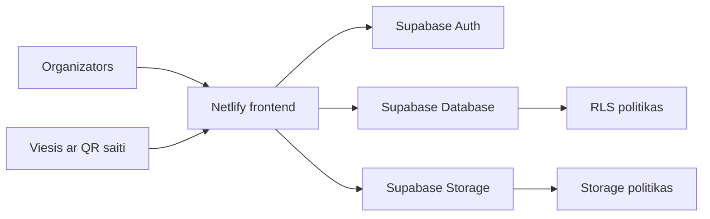

# Event Photo SaaS MVP arhitektura

## Merkis

Event Photo SaaS MVP ir photo-only pasakumu foto apkopošanas risinajums. Organizators izveido pasakumu, sanem viesu saiti un QR kodu, bet viesi bez konta var augšupieladet foto. Organizators pec pieslegšanas savam kontam redz tikai savus pasakumus un to galerijas.

## Galvenas sistemas dalas

### Frontend

Frontend ir statiska HTML, CSS un JavaScript lietotne:

- `index.html` nosaka lapas strukturu, autentifikacijas skatu, organizatora dashboard, event detail, guest upload un foto preview dialogu.
- `style.css` nosaka vizualo noformejumu, responsivo izkartojumu un komponentu stavoklus.
- `script.js` satur Supabase klienta inicializaciju, autentifikaciju, eventu izveidi, QR saiti, guest upload, galeriju, preview, dzesanu un lejupieladi.

Frontend izmanto Supabase publishable key. Projekta kodā netiek glabatas service role vai citas slepenas atslegas.

### Hosting

Hostings tiek nodrošinats ar Netlify:

- build komanda nav vajadziga, jo lietotne ir statiska;
- publish directory ir projekta sakne (`.`);
- `netlify.toml` nodrošina, ka `/event/*` saites tiek parvirzitas uz `index.html`, lai guest event route strada ari pec lapas refresh vai QR atveršanas.

### Supabase

Supabase nodrošina trīs MVP backend funkcijas:

- Supabase Auth organizatoru kontiem;
- Supabase Database datu glabašanai;
- Supabase Storage foto failiem.

Sakotneja datubazes un RLS konfiguracija atrodas `supabase/schema.sql`.

## Augsta limena arhitekturas schema



## Datu modelis

MVP izmanto četras galvenas tabulas:

- `users` - organizatora profils, kas sasaistits ar `auth.users`;
- `events` - organizatora izveidotie pasakumi;
- `guests` - viesa ieraksts konkreta pasakuma ietvaros;
- `media` - foto metadati, kas sasaista eventu, viesi un Storage faila celu.

Foto faili netiek glabati datubaze. Datubaze glaba tikai metadatus un `storage_path`, bet pats fails atrodas Supabase Storage bucket `event-photos`.

## Organizatora datu plusma

1. Organizators atver Netlify lapu.
2. Organizators registrejas vai piesledzas ar Supabase Auth.
3. Frontend ielade tikai tos `events`, kuru `owner_id` sakrit ar pieslegta lietotaja `auth.uid()`.
4. Organizators izveido eventu.
5. Frontend saglaba eventu Supabase Database tabula `events`.
6. Organizators atver event detail skatu.
7. Frontend izveido guest URL un QR kodu.
8. Organizators redz galeriju, kuras dati tiek lasiti no `media`, bet atteli tiek paraditi ar Supabase Storage signed URLs.
9. Organizators var atvert preview, parslegties starp foto, dzest foto, lejupieladet vienu foto vai visu galeriju ZIP formata.

## Viesa datu plusma

1. Viesis noskene QR kodu vai atver `/event/{slug}` saiti.
2. Frontend pec `slug` atrod aktivo eventu.
3. Viesis ievada vardu un uzvardu.
4. Frontend izveido `guests` ierakstu konkreta eventa ietvaros.
5. Viesis izvelas vai uznem foto.
6. Frontend parbauda faila tipu un 10 MB limitu.
7. Foto tiek augšupieladets Supabase Storage bucket `event-photos`.
8. Frontend izveido `media` ierakstu ar `event_id`, `guest_id`, `storage_path`, faila tipu un faila izmeru.
9. Viesis neredz galeriju; galerija ir paredzeta tikai organizatoram.

## Foto failu glabašanas struktura

Storage faili tiek kartoti lasami, lai organizatoram vajadzigas gadijuma butu vieglak saprast failu izcelsmi:

```text
event-name-1234/
  guest-name-5678/
    guest-name_2026-08-16_14-37-11.jpg
```

Event mape izmanto event nosaukumu un isu sufiksu, viesa mape izmanto viesa vardu/uzvardu un isu sufiksu, bet foto faila nosaukuma tiek ieklauts viesa vards un augšupielades datums/laiks.

## Drošibas robežas

MVP drošiba balstas uz Supabase RLS un Storage politikam:

- organizators lasa un labo tikai savus `events`;
- organizators redz tikai saviem eventiem piesaistitos `guests` un `media`;
- anon viesis var nolasit tikai aktiva eventa landing datus;
- anon viesis var pievienoties aktivam eventam un pievienot media ierakstu;
- organizators var lasit un dzest tikai saviem eventiem piesaistitos Storage failus;
- Storage bucket ir privats, galerijai tiek izmantotas signed URLs.

Svarigs princips: frontend ari filtre datus pec pieslegta lietotaja, bet patiesa piekluves kontrole notiek datubaze ar RLS.

## Deploy un konfiguracija

Netlify paliek tikai hostingam. Supabase ir backend slanis Auth, Database un Storage funkcijam. MVP nav atseviška servera vai Netlify Function, iznemot iespejamu nakotnes paplašinasanu, ja ZIP izveide velak bus javeic servera puse lielam galerijam.

Pašreizeja ZIP lejupielade tiek veidota parluuka puse, izmantojot galerijas signed URLs. Šis risinajums ir pietiekams MVP un mazam/vidējam foto skaitam.

## MVP robežas

Šaja MVP versija ir apzinati atstatas vienkaršas šadas lietas:

- nav maksajumu un abonementu;
- nav publiskas viesu galerijas;
- nav organizatora komandas vai vairaku administratoru;
- nav server-side bilžu apstrades;
- nav automatiska bilžu kompresija;
- nav atseviškas audit log sistēmas.

Tas palidz saglabat MVP fokusu: organizators izveido pasakumu, viesi augšupielade foto, organizators tos droši apskata un lejupielade.
