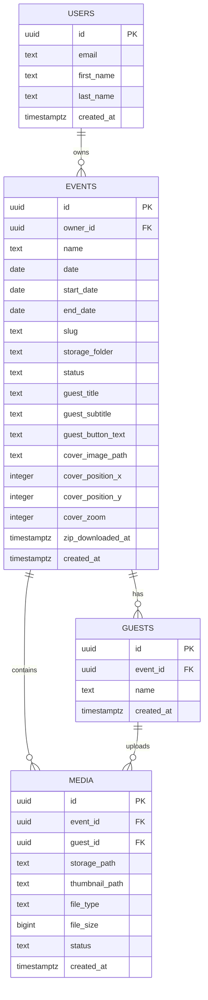

# Event Photo SaaS MVP datubazes modelis

## Merkis

Šis dokuments apraksta Event Photo SaaS MVP datubazes modeli, tabulu savstarpejas attiecibas un Supabase Storage failu strukturu. Datu modelis ir veidots ta, lai organizators varetu parvaldit tikai savus pasakumus, bet viesi bez konta varetu augšupieladet foto tikai konkreta aktiva pasakuma ietvaros.

Pilna SQL shema atrodas `supabase/schema.sql`.

## Datu modela parskats

MVP izmanto četras galvenas aplikacijas tabulas:

- `users` - organizatora profils;
- `events` - organizatora izveidotie pasakumi;
- `guests` - viesi, kas piesledzas konkretiem pasakumiem;
- `media` - foto metadati un saite uz Supabase Storage failu.

Papildus tiek izmantots Supabase Storage bucket:

- `event-photos` - privats bucket, kura glabajas augšupieladetie foto faili.

## Relaciju schema



## `users`

`users` tabula glaba aplikacijas organizatora profilu. Ta ir piesaistita Supabase Auth tabulai `auth.users`.

| Kolonna | Tips | Nozime |
| --- | --- | --- |
| `id` | `uuid` | Lietotaja ID, kas sakrit ar `auth.users.id` |
| `email` | `text` | Organizatora e-pasts |
| `first_name` | `text` | Organizatora vards |
| `last_name` | `text` | Organizatora uzvards |
| `created_at` | `timestamptz` | Profila izveides laiks |

Kad Supabase Auth izveido jaunu lietotaju, trigger funkcija `handle_new_user()` izveido vai atjauno ierakstu `public.users` tabula.

Drošibas princips: lietotajs var lasit un atjaunot tikai savu profilu.

## `events`

`events` tabula glaba organizatora izveidotos pasakumus.

| Kolonna | Tips | Nozime |
| --- | --- | --- |
| `id` | `uuid` | Pasakuma unikals ID |
| `owner_id` | `uuid` | Organizatora `users.id` |
| `name` | `text` | Pasakuma nosaukums |
| `date` | `date` | Savietojamibas datums, kas sakrit ar `start_date` |
| `start_date` | `date` | Pasakuma sakuma datums |
| `end_date` | `date` | Pasakuma beigu datums |
| `slug` | `text` | Publiskaja guest URL izmantots identifikators |
| `storage_folder` | `text` | Lasams Storage pirmais folderis ar event nosaukumu un isu sufiksu |
| `status` | `text` | `active`, `inactive` vai `deleted` |
| `guest_title` | `text` | Viesu ekrana virsraksts |
| `guest_subtitle` | `text` | Viesu ekrana papildteksts |
| `guest_button_text` | `text` | Foto pogas teksts viesu ekrana |
| `cover_image_path` | `text` | Eventa viesu ekrana cover attela Storage cels |
| `cover_position_x` | `integer` | Cover attela horizontala pozicija procentos |
| `cover_position_y` | `integer` | Cover attela vertikala pozicija procentos |
| `cover_zoom` | `integer` | Cover attela palielinajums procentos |
| `zip_downloaded_at` | `timestamptz` | Laiks, kad ZIP arhivs lejupieladets pirmo reizi |
| `created_at` | `timestamptz` | Pasakuma izveides laiks |

`owner_id` ir galvena kolonna organizatoru datu izolacijai. Organizatora dashboard vaicajumi filtre eventus pec `owner_id`, un RLS politika papildus nodrošina, ka organizators lasa tikai savus eventus.

`slug` tiek izmantots viesu saitei:

```text
/event/{slug}
```

Piemers:

```text
https://event-photo-saas.netlify.app/event/kazas-qkyx7b
```

`start_date` un `end_date` nosaka periodu, kura viesu QR/link ir pieejams foto augšupieladei. MVP periods nedrikst parsniegt 3 dienas. `guest_title`, `guest_subtitle`, `guest_button_text` un cover lauki tiek izmantoti viesu UX pielagošanai.

## `guests`

`guests` tabula glaba viesus, kas piesledzas konkreta eventa guest plūsmai.

| Kolonna | Tips | Nozime |
| --- | --- | --- |
| `id` | `uuid` | Viesa ieraksta ID |
| `event_id` | `uuid` | Pasakums, kuram viesis pievienojas |
| `name` | `text` | Viesa ievaditais vards un uzvards |
| `created_at` | `timestamptz` | Pievienošanas laiks |

Viesim nav nepieciešanas konts. Viesis ievada vardu/uzvardu, un frontend izveido `guests` ierakstu konkreta aktiva eventa ietvaros.

Organizators var lasit tikai tos viesus, kas piesaistiti vina eventiem.

## `media`

`media` tabula glaba foto metadatus. Pats foto fails atrodas Supabase Storage.

| Kolonna | Tips | Nozime |
| --- | --- | --- |
| `id` | `uuid` | Foto metadatu ID |
| `event_id` | `uuid` | Pasakums, kuram foto pieder |
| `guest_id` | `uuid` | Viesis, kas augšupieladeja foto |
| `file_url` | `text` | Rezervets nakotnes vajadzibam |
| `thumbnail_url` | `text` | Rezervets nakotnes publiska thumbnail URL vajadzibam |
| `storage_path` | `text` | Supabase Storage faila cels |
| `thumbnail_path` | `text` | Supabase Storage thumbnail faila cels |
| `file_type` | `text` | Faila MIME tips, piemeram `image/jpeg` |
| `file_size` | `bigint` | Faila izmers baitos |
| `created_at` | `timestamptz` | Augšupielades laiks |
| `status` | `text` | `uploaded` vai `deleted` |

`media` ieraksts ir galvena saikne starp datubazi un Storage failiem. Organizatora galerija lasa `media` ierakstus, pec tam grid skatam izveido signed URLs no `thumbnail_path`, bet oriģinalo `storage_path` izmanto preview, dzēšanai un ZIP sagatavošanai.

Dzeshanas gadijuma Storage fails tiek dzests pirmais, pec tam `media.status` tiek mainits uz `deleted`. Tas palidz saglabat korektu stavokli, ja Storage dzeshana neizdodas.

## Storage bucket `event-photos`

Foto faili tiek glabati privata Supabase Storage bucket:

```text
event-photos
```

Bucket konfiguracija:

- `public = false`;
- maksimlais faila izmers: 6 MB;
- atlautie tipi: `image/jpeg`, `image/png`, `image/webp`, `image/gif`, `image/heic`, `image/heif`.

Galerijas atteli netiek padariti publiski. Organizatora skatam tiek veidotas pagaidu signed URLs. Grid skatā tiek izmantoti thumbnail faili, lai samazinatu Supabase egress.

## Storage path struktura

Storage faili tiek kartoti lasami, lai organizators vajadzigas gadijuma varetu saprast, kurš viesis un kad foto uznemis.

Struktura:

```text
event-name-1234/
  guest-name-5678/
    guest-name_yyyy-mm-dd_hh-mm-ss.jpg
    thumb_guest-name_yyyy-mm-dd_hh-mm-ss.jpg
```

Piemers:

```text
kazas-4821/
  janis-berzins-7394/
    janis-berzins_2026-08-16_14-37-11.jpg
    thumb_janis-berzins_2026-08-16_14-37-11.jpg
```

Šada struktura ir noderiga ari ZIP lejupieladei, jo ZIP faila var saglabat mapju dalijumu pec eventa un viesa.

Cover atteli tiek glabati atsevišķa pirma limena folderi:

```text
event-covers/
  event-storage-folder/
    cover_yyyy-mm-dd_hh-mm-ss.jpg
```

## Indeksi

Shēma pievieno indeksus biežakajiem vaicajumiem:

- `events_owner_id_idx` - organizatora eventu atrašanai;
- `events_slug_idx` - guest URL eventa atrašanai pec `slug`;
- `guests_event_id_idx` - eventa viesu atrašanai;
- `media_event_id_idx` - eventa galerijas ieladei;
- `media_guest_id_idx` - foto sasaistisanai ar viesi.

Šie indeksi palidz uzturet vienkaršu un atru MVP datu plūsmu.

## RLS sasaite ar datu modeli

Datu modelis ir veidots ap `owner_id`, `event_id` un `storage_path`.

Galvenie drošibas noteikumi:

- `events.owner_id = auth.uid()` nosaka, kurš organizators drikst redzet eventu;
- `guests.event_id` lauj parbaudit, vai viesis pieder organizatora eventam;
- `media.event_id` lauj parbaudit, vai foto pieder organizatora eventam;
- `media.storage_path = storage.objects.name` sasaista datubazes media ierakstu ar originalo Storage objektu;
- `media.thumbnail_path = storage.objects.name` sasaista datubazes media ierakstu ar thumbnail objektu.

Tas nozime, ka organizatora piekluve galerijai netiek balstita tikai uz frontend filtru. To nodrošina ari Supabase RLS un Storage politikas.

## Nakotnes paplašinajumi

Nakotne datu modeli varetu paplašinat ar:

- foto limitu vienam viesim;
- reveal-after-event iestatijumu;
- server-side attelu apstradi un thumbnail ģenerēšanu;
- server-side ZIP ģenerēšanu;
- automātisku Storage cleanup;
- audit log ierakstiem organizatora darbibam.

Šie papildinajumi ir planoti ka MVP+ funkcijas, bet pašreizejais modelis jau nodrošina galveno mērķi: drošu eventu, viesu un foto sasaisti.
