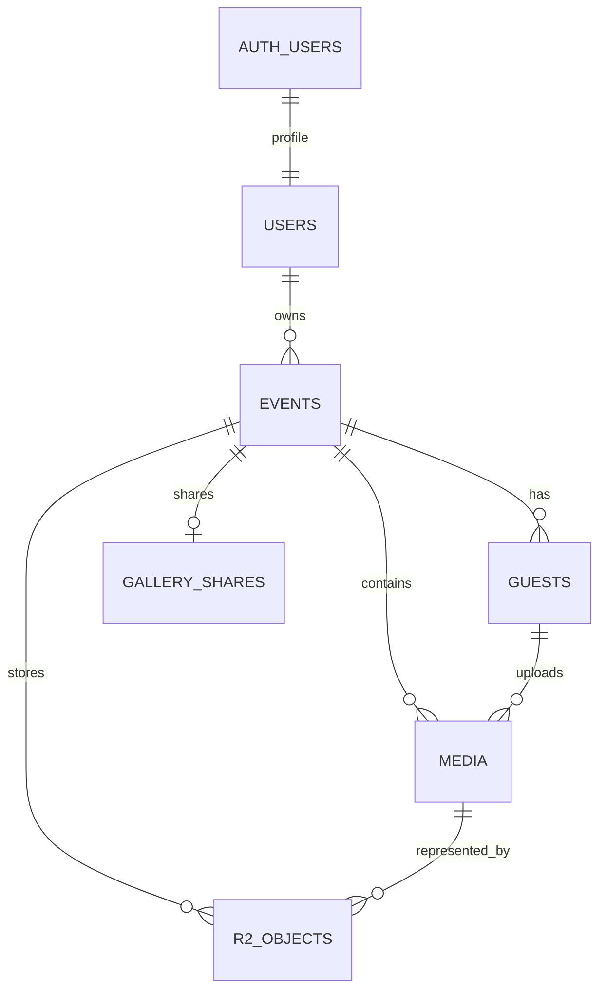

# Event Photo SaaS MVP datubazes modelis

## Merkis

PostgreSQL glaba identitates, pasakumu noteikumus un foto metadatus. Attelu binarie dati jaunajai plusmai atrodas privata Cloudflare R2, bet vecie objekti var palikt privata Supabase Storage bucket. Datubaze ir patiesibas avots par to, kam objekts pieder un vai tas ir pieejams.

## Attiecibas



## `users`

Organizatora publiskais profils, kura `id` sakrit ar `auth.users.id`.

Svarigie lauki:

- `id uuid` - primara atslega un Auth lietotaja ID;
- `email text`;
- `first_name text`;
- `last_name text`;
- `created_at timestamptz`.

RLS atlauj organizatoram lasit un labot tikai savu profilu.

## `events`

Pasakuma konfiguracija un dzives cikls.

Svarigie lauki:

- `id uuid`;
- `owner_id uuid` -> `users.id`;
- `name text`;
- `slug text unique` - publiskas viesa saites identifikators;
- `status text` - aktivs, neaktivs vai arhivets/dzests stavoklis;
- `start_date`, `end_date`, `start_time`, `end_time`;
- `time_zone text` - IANA laika zona;
- `starts_at`, `ends_at timestamptz` - genereti realie laika momenti;
- `storage_folder text` - vecas Storage strukturas saderibai;
- `guest_title`, `guest_subtitle`, `guest_button_text`;
- `cover_image_path`, `cover_position_x`, `cover_position_y`, `cover_zoom`;
- `zip_downloaded_at timestamptz`;
- `created_at timestamptz`.

Datubaze parbauda, ka laika zona eksiste, vietejais laiks nav neeksistejoss vai divdomigs DST pareja un `ends_at > starts_at`. Upload periods ir `starts_at <= now < ends_at`.

## `guests`

Viesa identitate tikai viena pasakuma ietvaros.

- `id uuid`;
- `event_id uuid` -> `events.id`;
- `name text`;
- `created_at timestamptz`.

Viesim nav ieraksta `auth.users`. Vienadi vardi nekonflikte, jo media un R2 struktura izmanto `guest_id`.

## `media`

Viena foto logiskais ieraksts.

- `id uuid`;
- `event_id uuid` -> `events.id`;
- `guest_id uuid` -> `guests.id`;
- `storage_path text` - originala logiskais cels;
- `thumbnail_path text` - thumbnail logiskais cels;
- `file_type text`;
- `file_size bigint`;
- `status text` - `pending`, `uploaded` vai kļudas/tirisanas stavoklis;
- `created_at timestamptz`.

`media` nesatur attela binaros datus. `pending` ieraksts atlauj droši nodalit rezervaciju no pabeigta foto. Galerija izmanto tikai pabeigtos ierakstus.

## `gallery_shares`

Organizatora vadita pec-pasakuma viesu galerijas piekluve.

- `event_id uuid` - viena konfiguracija katram eventam;
- ieslegsanas stavoklis;
- piekluves beigu laiks;
- lietojuma/pieprasijumu skaititaji un tehniskie limiti;
- atjaunosanas laiks.

`manage_gallery_share` parbauda eventa ipasnieku, to, ka events ir beidzies, un atlauto kopigosanas logu. `guest_gallery_access` ir pieejams tikai servera lomai; Worker to izmanto katram saraksta vai foto pieprasijumam.

## `r2_objects`

Privata R2 objekta reģistrs.

Svarigie lauki:

- objekta logiskais `path`;
- faktiskais `object_key` R2 bucket;
- `event_id`, `media_id`, `guest_id` vai `owner_id` atkariba no objekta tipa;
- `content_type` un `file_size`;
- checksum;
- rezervacijas tokena hash;
- objekta stavoklis;
- `organizer_folder`, `event_folder`, `guest_folder` lasamai Cloudflare navigacijai;
- izveides un pabeigsanas laiki.

`object_key` tiek veidots servera puse. Klients nevar patvaligi izvēleties cita organizatora, eventa vai viesa prefiksu.

## Servera funkcijas

### `prepare_photo_upload`

Parbauda eventu, viesi, periodu, MIME tipu, izmeru un celi. Izveido vai droši atkartoti izmanto `pending` media ierakstu.

### `complete_photo_upload`

Vecas Supabase Storage plusmas saderibai parbauda, ka originals un thumbnail reali eksiste bucket, un tikai tad pabeidz media ierakstu.

### `reserve_r2_object`

Izpildama tikai `service_role`. Parbauda:

- vai upload konkreta eventa ir atverts;
- vai media/guest/owner attiecibas sakrit;
- vai cels pieder sagaiditajam objektam;
- `image/webp` MIME tipu;
- 1..6 MiB originalam un ne vairak ka 1 MiB thumbnail;
- checksum un rezervacijas tokenu;
- dublēšanos un eventa kopējo tehnisko robezu.

### `complete_r2_photo`

Izpildama tikai `service_role`. Pabeidz media tikai tad, ja originala un thumbnail R2 reģistra ieraksti ir parbauditi. Atkartots tas pats pabeigsanas pieprasijums nemaina rezultatu.

### `guest_gallery_access`

Izpildama tikai `service_role`. Atgriez tikai tos pabeigtos foto, kurus konkreta eventa viesu galerija vel drikst lasit. Ta ari nosaka thumbnail/originala logisko celi vienam foto.

## RLS princips

RLS ir obligats tabulam ar lietotaju datiem:

- `users`: `id = auth.uid()`;
- `events`: `owner_id = auth.uid()`;
- `guests`: organizators lasa viesus tikai caur saviem eventiem;
- `media`: organizators lasa un parvalda media tikai caur saviem eventiem;
- `gallery_shares`: maina tikai eventa ipasnieks;
- `r2_objects`: frontend lomam nav tiesas rakstisanas tiesibu.

UI paslepta poga nav drošibas kontrole. Galiga atļauja vienmer japarbauda datubaze vai Worker.

## Failu ceļi

Jaunajiem R2 failiem fiziska struktura ir lasama, bet identitates ziņa nemainiga:

```text
organizer-name--owner-uuid/
  event-name--event-uuid/
    guest-name--guest-uuid/
      guest-name_2026-09-15T18-10-44Z_media-uuid.webp
      thumb-guest-name_2026-09-15T18-10-44Z_media-uuid.webp
```

Nosaukumi tiek normalizeti. UUID nodrosina unikālumu, tapec vienadi organizatoru, eventu vai viesu vardi nerada konfliktu.

## Migraciju seciba esosam projektam

```text
20260911_guest_gallery.sql
20260912_media_reliability.sql
20260912_r2_storage.sql
20260912_r2_id_folders.sql
20260912_event_times.sql
20260914_r2_readable_folders.sql
```

Migracijas nedrikst aizstat ar vienkarsu frontend deploy. Pec katras produkcijas migracijas japarbauda funkciju tiesibas, RLS un reala pamatplusma.

## Veco datu saderiba

Vecie media ieraksti var noradit uz privato `event-photos` Supabase Storage bucket. Worker atpazist avotu un lasa veco objektu caur Supabase servera API. Jaunie faili tiek rakstiti R2. Vecie objekti netiek automātiski parvietoti vai dzesti.
